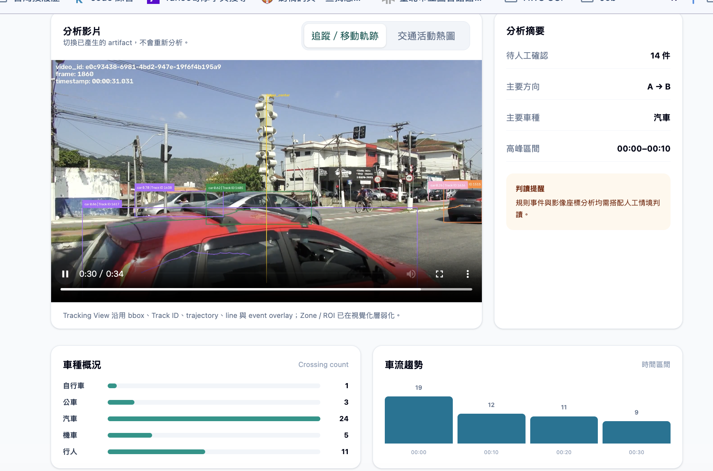
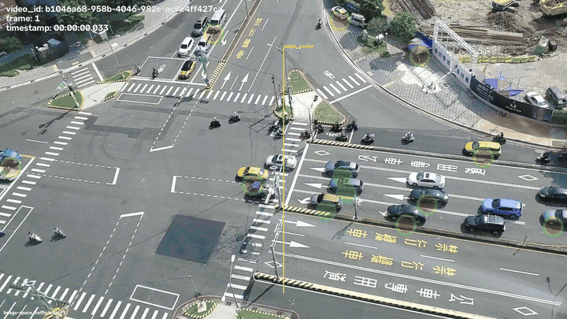

# Real-Time Vision Analytics & Event Detection System

即時交通影像分析與事件偵測系統。

本專案以交通影片為輸入，整合 **YOLO 物件偵測、ByteTrack 多目標追蹤、移動軌跡、空間事件分析、Evidence Capture、Traffic Analytics、FastAPI Backend 與 React Dashboard**。

核心流程：

**偵測 → 追蹤 → 軌跡 → 空間判斷 → 事件 → 證據 → 分析 → Dashboard**

---

# 專案展示

## React Dashboard



> **Dashboard Overview**
> 以分析影片作為主要視覺焦點，整合 Tracking / Trajectory、交通分析、事件摘要與 Evidence Review。
> 使用者可以快速查看主要車種、車流高峰、事件候選與分析結果，不需要直接閱讀大量 Raw Tables。

---

## Tracking / Trajectory Visualization


> 使用 YOLO + ByteTrack 進行交通物件偵測與多目標追蹤，並將 Track ID 與移動軌跡視覺化。
> Tracking 結果會提供給 Line Crossing、Direction、Dwell 與 Event Detection 等後續分析。

---

## Traffic Activity Heatmap



> Heatmap 根據既有 Tracking 結果累積交通物件在影像中的活動位置。
> 顏色較集中的區域代表較頻繁的影像活動；此結果屬於 **image-space traffic activity**，不代表真實世界交通密度、事故熱點或碰撞風險。

---

# 系統架構

```text
交通影片
    ↓
影片驗證
    ↓
OpenCV Frame Pipeline
    ↓
YOLO Object Detection
    ↓
ByteTrack Multi-Object Tracking
    ↓
Trajectory Engine
    ↓
Spatial Intelligence
    ├─ Line Crossing
    ├─ Zone / ROI
    ├─ Direction
    ├─ Dwell / Stationary
    └─ Proximity
    ↓
Event Engine
    ↓
Evidence Capture
    ↓
Traffic Analytics
    ↓
FastAPI
    ↓
React Dashboard
```

---

# 核心功能

- **物件偵測**：Person、Bicycle、Car、Motorcycle、Bus、Truck
- **多目標追蹤**：ByteTrack 維持跨 frame 的 Track ID
- **移動軌跡**：保存 Track 歷史位置並進行視覺化
- **Line Crossing**：以 Track-based Count 判斷是否通過虛擬計數線
- **Zone / ROI**：Zone Entry、Zone Exit、Occupancy、Peak Occupancy
- **Wrong-Way Candidate**：依移動方向產生逆向候選
- **Dwell / Stationary**：長時間停留與靜止車輛判斷
- **Proximity Warning**：Person–Vehicle image-space proximity 候選
- **Event Review**：統一 Event Schema 與人工檢視
- **Evidence Capture**：事件對應 Evidence Snapshot
- **Traffic Analytics**：車種分布、車流趨勢、方向、Zone Activity、Peak Interval
- **Tracking / Heatmap Visualization**
- **React Dashboard**

---

# Event Types

目前支援：

- `LINE_CROSSING｜通過計數線`
- `ZONE_ENTRY｜進入區域`
- `ZONE_EXIT｜離開區域`
- `WRONG_WAY｜逆向候選`
- `LONG_DWELL｜長時間停留`
- `STATIONARY_VEHICLE｜靜止車輛`
- `PEDESTRIAN_INTRUSION｜行人進入監控區`
- `PROXIMITY_WARNING｜接近警示`

部分事件屬於規則候選，需要人工確認：

- **Wrong-Way**：不代表已確認交通違規
- **Proximity Warning**：不代表實際距離或碰撞風險
- **Line Crossing**：不代表完整交通流量普查

---

# Runtime Profiles

| 分析模式 | imgsz | Confidence |
|---|---:|---:|
| 一般道路 Standard | 640 | 0.25 |
| 空拍 Aerial | 960 | 0.15 |

正式 runtime 使用 **YOLO26n pretrained model**。

---

# Data

## Runtime Traffic Videos

使用 Pexels 公開交通影片作為 Demo，包含：

- Highway
- Taipei
- Urban
- Aerial Intersection

主要用於：

- Object Detection
- Tracking
- Trajectory
- Event Detection
- Traffic Analytics
- Dashboard Demo

## Taiwan Traffic Dataset

使用 Taiwan Traffic Dataset 進行：

- Dataset QA
- Object Distribution Analysis
- Small Object Analysis
- Fine-tuning Experiment
- Baseline Evaluation
- Locked Test

Dataset QA 發現 small objects 比例偏高，Person 樣本量相對不足。

---

# Model Evaluation 與 Governance

本專案除了使用 pretrained model，也進行 Taiwan Traffic Dataset fine-tuning。

Locked Test：

| Model | Precision | Recall | mAP50 | mAP50-95 |
|---|---:|---:|---:|---:|
| Pretrained | 0.3731 | 0.2683 | 0.2253 | 0.0897 |
| Fine-tuned Candidate | 0.8250 | 0.5592 | 0.6462 | 0.3712 |

雖然 Fine-tuned Candidate 整體指標提升，但 class-level evaluation 發現：

**Fine-tuned Candidate 的 Person Recall = 0**

Pretrained model 的 Person Recall 約為：

**0.2957**

因此 Promotion Decision 為：

**Candidate Model：REJECTED**

正式 runtime 繼續使用 pretrained model。

此流程展示：

- Dataset QA
- Baseline Evaluation
- Fine-tuning
- Locked Test
- Class-level Regression Detection
- Promotion Gate
- Model Governance

而不是只依賴整體 mAP 決定是否部署模型。

---

# 技術架構

## Frontend

- React
- TypeScript
- Vite
- Tailwind CSS
- TanStack Query
- Recharts

前端負責：

- Video Upload
- Job Status
- Progress Polling
- KPI
- Tracking / Heatmap Video
- Traffic Analytics
- Event Review
- Evidence Review
- Engineering Information

前端不執行 YOLO 或 Event Calculation。

## Backend

- FastAPI
- REST API
- Job-based Processing
- H.264 Browser-compatible Video Delivery

Job Lifecycle：

```text
CREATED
   ↓
PROCESSING
   ↓
COMPLETED / FAILED
```

主要 API：

```text
GET  /health
POST /jobs
GET  /jobs/{job_id}
GET  /jobs/{job_id}/results
GET  /jobs/{job_id}/events
GET  /jobs/{job_id}/evidence/{event_id}
```

## AI / Computer Vision

- Python
- PyTorch
- Ultralytics YOLO
- ByteTrack
- OpenCV
- Supervision

Supervision 主要負責 Visualization Layer：

- Bounding Box
- Label
- Track Trace
- Traffic Activity Heatmap

核心 Track ID 仍由既有 ByteTrack pipeline 管理。

## Data / Analytics

資料處理與分析包含：

- Video Frame Processing
- Detection Records
- Track Records
- Trajectory History
- Event Records
- Evidence Metadata
- Traffic Interval Analytics
- Class Distribution
- Direction Distribution
- Zone Activity

Structured outputs 透過 FastAPI 提供給 React Dashboard。

---

# Testing

## Backend / Python

```text
268 tests passed
```

## Frontend

```text
15 tests passed
```

## Production Build

```text
TypeScript / Vite Build：PASS
```

## Dependency Audit

```text
npm audit：0 vulnerabilities
```

Browser Smoke Test 已驗證：

- Standard / Aerial Video Upload
- Job Polling
- Processing Progress
- COMPLETED State
- Tracking / Heatmap Switching
- Traffic Analytics
- Events
- Evidence State
- Responsive Layout
- New Analysis

Browser Console：

```text
0 errors
```

---

# 本機啟動

## 1. 啟動 FastAPI

```bash
source .venv/bin/activate
uvicorn vision_analytics.api.app:app --app-dir src --reload
```

FastAPI：

```text
http://127.0.0.1:8000
```

## 2. 啟動 React Dashboard

```bash
cd frontend
npm install
npm run dev
```

React Dashboard：

```text
http://localhost:5173
```

---

# 專案重點

這個專案展示完整的 Computer Vision Engineering Workflow：

```text
Object Detection
      ↓
Multi-Object Tracking
      ↓
Trajectory
      ↓
Spatial Intelligence
      ↓
Event Detection
      ↓
Evidence
      ↓
Traffic Analytics
      ↓
FastAPI
      ↓
React Dashboard
```

除了模型本身，也包含：

- Dataset QA
- Model Evaluation
- Locked Test
- Regression Detection
- Model Promotion Decision
- Backend API
- Frontend Dashboard
- Automated Testing

專案核心不只是使用 YOLO 偵測交通物件，而是將 Computer Vision 模型整合成一套可分析、可檢視、可評估的端到端交通影像分析系統。
